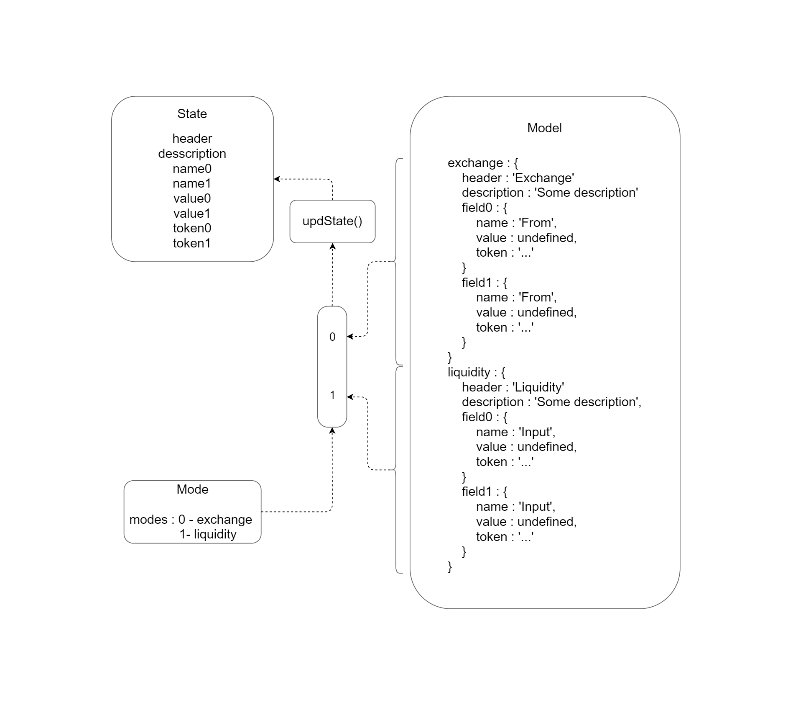

# Dex

#### Preparing for usage

* install necessary dependencies
```
    npm install
```
* update web-enq submodule
```
    git submodule init
    git submodule update
```
* start the server
```
    pm2 start server.js
```

#### Data structure

Acording the React.JS rules the app uses 'state' variable in order to bind properties of interface particles. It was realised side data structure and method to manage 'interface data' for a reason of inconvenience of using nested structures in the 'state'. Take a look at this structure:



#### Frontend scheme

User interactions scheme. Red border page is the start page.


#### Formulas for auto-complete

Exchange : 
    (1 - pool_fee) * liqudity / amount_in
    liquidity = volume_1 * volume_2

Liquidity : 
    input_1 * volume_2 / volume_1 or input_2 * volume_1 / volume_2 

For more information about AMM DEX functional visit: https://github.com/Enecuum/internal-docs/blob/master/etp5.md
