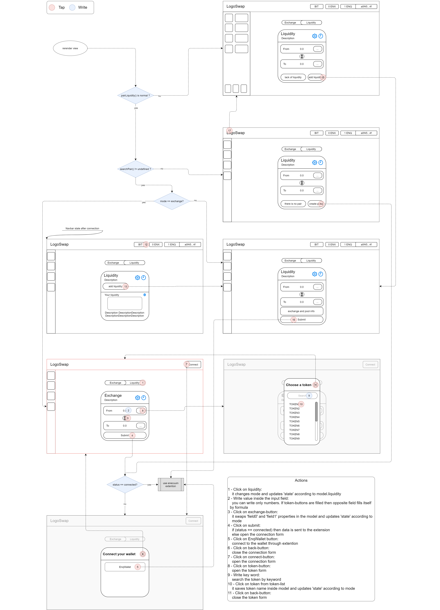

# Dex

#### Intro 
This is the web application for DEX AMM (Decentralized EXchange with Automatic Market Making) infrastructure. Here you cand find all information about frontend part of that project.
    
#### Technologies
* Language: JavaScript
* Framework: React.js, docs - https://reactjs.org/docs/getting-started.html
* CSS-Framework: Bootstrap v4.6, docs - https://getbootstrap.com/docs/4.6/getting-started/introduction/
* Module bundler: Webpack, docs - https://webpack.js.org/api/
* Transcompiler: Babel, docs - https://babeljs.io/docs/en/
* State container: Redux, docs - https://redux.js.org/introduction/getting-started

#### Dependencies
For communication with Enecuum blockchain application you must use the web-enq library and Enecuum-wallet extention. At the moment site maintains five methods:
* connect()
* enable() -> {pubkey, net}
* balanceOf(to, tokenHash}) -> {amount, decimals, delegated, reward, transit, undelegated}
* sendTransaction(from, to, value, tokenHash)
* net.getProvider() -> {net}
To learn more about web-enq API, visit - https://github.com/Enecuum/web-enq/blob/e392d8a51d993cc6fbce2de65ef6a5ce4f7e84a8/ENQweb3lib.md

#### Preparing for usage
* install necessary dependencies
```
    npm install
```
* update web-enq submodule
```
    git submodule init
    git submodule update
```
* create config.json, copy structure from config.example.json, write valid url in 'dex_url' property and valid port in 'dex_port' property (it is necessary for dex stub)
* install pm2

#### Usage
* start webpack-dev server
```
    npm run dev
```
* build the application with webpack (check the mode inside [./webpack.config.js][2])
```
    npm run make
```
* perform debugging of the production server
```
    npm run test_prod
```
* run production server
```
    npm run prod
```
After assembling all files are put inside [./public][1] directory, where index.html is the frontend entry point, and enex.webpack.js is the js bundle.

#### Webpack config
All settings for webpack module locates into [./webpack.config.js][2].
Essential roperties:
* [entry][3] - root file, which imports all scripts, styles and other assets
* [output][4] - property for specifying output bundle
* [module.rules][5] - amount of modules and their rools for creating right imports
* [devServer][6] - configuration field with server deployment properties (read more about in on https://webpack.js.org/configuration/dev-server/)

#### Develop mode

Use webpack dev server for more convenient development. It is the best to create stubs inside the {before} property in webpack.config.js just like in the example:
```
    before: (app) => {
        app.get('/getLanguage/*', (req, res) => {
            ...
            res.json(JSON.parse(fs.readFileSync(`./data/${language}.json`, { encoding : 'utf-8' })));
        });
        app.get('/getTokens', (req, res) => {
            ...
            res.json(JSON.parse(fs.readFileSync(`./data/tokens.json`, { encoding : 'utf-8' })));
        });
        app.get('/enqlib', (req, res) => {
            ...
            res.send(fs.readFileSync(`./web-enq/prebuild/enqweb3.min.js`, { encoding : 'utf-8' }));
        });
        ...
    }
```
It is easy to use because of similarity to express node-module.

Run dev server:
```
    npm run dev
```

#### Redux

We use Redux for more comfortable supervising of components states. You can find contatiner inside the [./assets/store][7] directory. There is introduced seven main files and directories for creating main redux structure:
* store.js - main assembly file
* initialState.js and pageDataPresets.js - describe main state structure of the project
* [./actions][8] and [./actionCreators][9] - directories with rules and methods for using redux store
* [./reducers][10] - middle layer for store control, change state object acording the actions
* storetoProps.js - node for states and methods distribution across the components (react-redux connect())

#### Frontend scheme

User interactions scheme. Red border page is the start page.



#### Enecuum AMM DEX documentation 

For more information about AMM DEX functional read: https://github.com/Enecuum/docs/issues/6

[1]:https://github.com/Enecuum/dex/tree/develop/public
[2]:https://github.com/Enecuum/dex/blob/develop/webpack.config.js
[3]:https://github.com/Enecuum/dex/blob/9b28e3dffff43396e6503e089d8f373b2bf39259/webpack.config.js#L6
[4]:https://github.com/Enecuum/dex/blob/9b28e3dffff43396e6503e089d8f373b2bf39259/webpack.config.js#L7
[5]:https://github.com/Enecuum/dex/blob/9b28e3dffff43396e6503e089d8f373b2bf39259/webpack.config.js#L12
[6]:https://github.com/Enecuum/dex/blob/9b28e3dffff43396e6503e089d8f373b2bf39259/webpack.config.js#L31
[7]:https://github.com/Enecuum/dex/tree/master/assets/store
[8]:https://github.com/Enecuum/dex/tree/master/assets/store/actions
[9]:https://github.com/Enecuum/dex/tree/master/assets/store/actionCreators
[10]:https://github.com/Enecuum/dex/tree/master/assets/store/reducers
