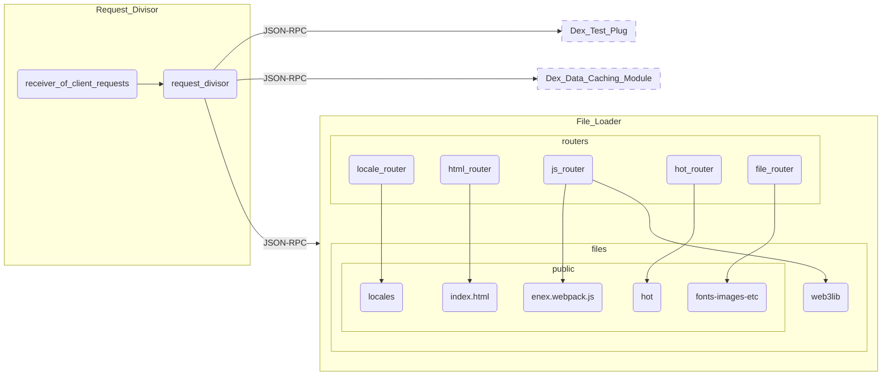

```mermaid
    flowchart LR
        subgraph Request_Divisor 
            rcr(receiver_of_client_requests)
            rd(request_divisor)
            rcr --> rd
        end

        subgraph File_Loader
            subgraph routers
                lr(locale_router)
                htmlr(html_router)
                jsr(js_router)
                fr(file_router)
                hr(hot_router)
            end

            subgraph files
                subgraph public
                    enex.webpack.js
                    index.html
                    locales
                    fonts-images-etc
                    hot
                end
                web3lib
            end
        end

        subgraph Dex_Test_Plug
        end

        subgraph Dex_Data_Сaching_Module
        end

    lr      --> locales(locales)
    htmlr   --> index.html(index.html)
    jsr     --> enex.webpack.js(enex.webpack.js)
    jsr     --> web3lib(web3lib)
    hr      --> hot(hot)
    fr      --> fonts-images-etc(fonts-images-etc)

    rd -->|JSON-RPC| File_Loader
    rd -->|JSON-RPC| Dex_Test_Plug
    rd -->|JSON-RPC| Dex_Data_Сaching_Module

    style Dex_Data_Сaching_Module stroke-width:1px, stroke-dasharray: 10 10
    style Dex_Test_Plug stroke-width:1px, stroke-dasharray: 10 10
```