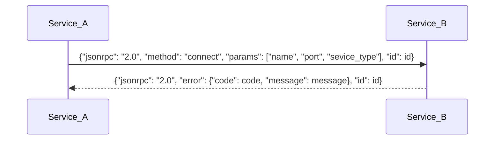
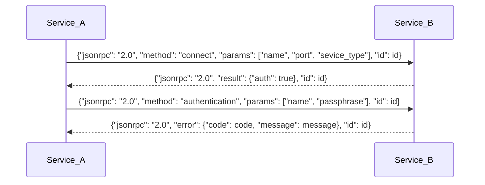
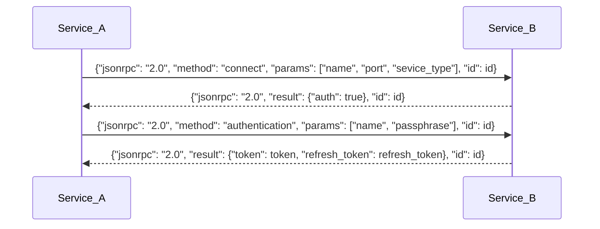
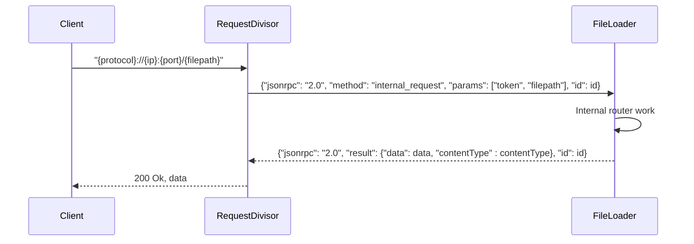
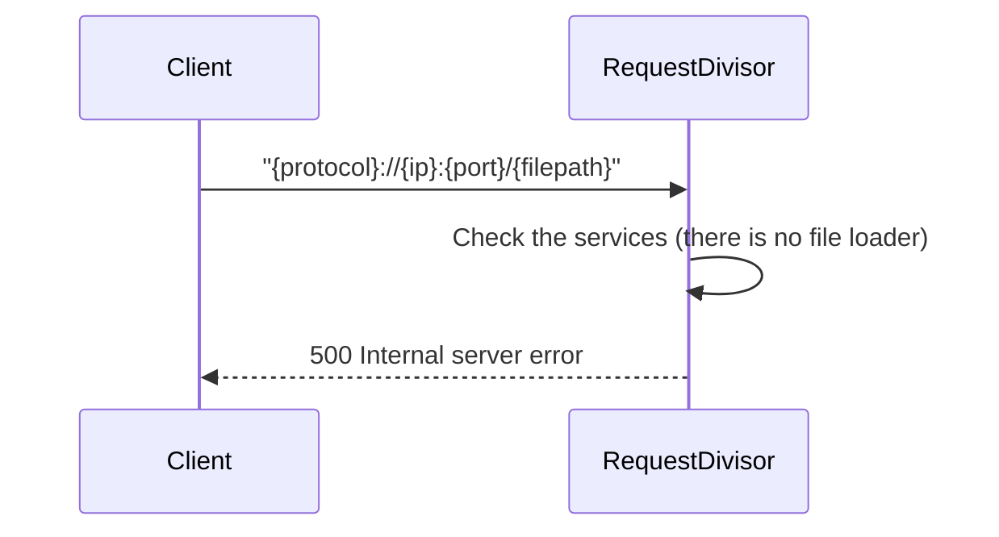

```mermaid
    sequenceDiagram
        participant Service_A
        participant Service_B

        Service_A ->> Service_B: {"jsonrpc": "2.0", "method": "connect", "params": ["name", "port", "sevice_type"], "id": id}
        Service_B -->> Service_A: {"jsonrpc": "2.0", "error": {"code": code, "message": message}, "id": id}
```

```mermaid
    sequenceDiagram
        participant Service_A
        participant Service_B

        Service_A ->> Service_B: {"jsonrpc": "2.0", "method": "connect", "params": ["name", "port", "sevice_type"], "id": id}
        Service_B -->> Service_A: {"jsonrpc": "2.0", "result": {"auth": true}, "id": id}
        Service_A ->> Service_B: {"jsonrpc": "2.0", "method": "authentication", "params": ["name", "passphrase"], "id": id}
        Service_B -->> Service_A: {"jsonrpc": "2.0", "error": {"code": code, "message": message}, "id": id}
```

```mermaid
    sequenceDiagram
        participant Service_A
        participant Service_B

        Service_A ->> Service_B: {"jsonrpc": "2.0", "method": "connect", "params": ["name", "port", "sevice_type"], "id": id}
        Service_B -->> Service_A: {"jsonrpc": "2.0", "result": {"auth": true}, "id": id}
        Service_A ->> Service_B: {"jsonrpc": "2.0", "method": "authentication", "params": ["name", "passphrase"], "id": id}
        Service_B -->> Service_A: {"jsonrpc": "2.0", "result": {"token": token, "refresh_token": refresh_token}, "id": id}
```

```mermaid
        sequenceDiagram
        participant Client
        participant RequestDivisor
        participant FileLoader

        Client ->> RequestDivisor: "{protocol}://{ip}:{port}/{filepath}"
        RequestDivisor ->> FileLoader: {"jsonrpc": "2.0", "method": "internal_request", "params": ["token", "filepath"], "id": id}
        FileLoader ->> FileLoader: Internal router work
        FileLoader -->> RequestDivisor: {"jsonrpc": "2.0", "result": {"data": data, "contentType" : contentType}, "id": id}
        RequestDivisor -->> Client: 200 Ok, data
```

```mermaid
        sequenceDiagram
        participant Client
        participant RequestDivisor

        Client ->> RequestDivisor: "{protocol}://{ip}:{port}/{filepath}"
        RequestDivisor ->> RequestDivisor: Check the services (there is no file loader)
        RequestDivisor -->> Client: 500 Internal server error
```