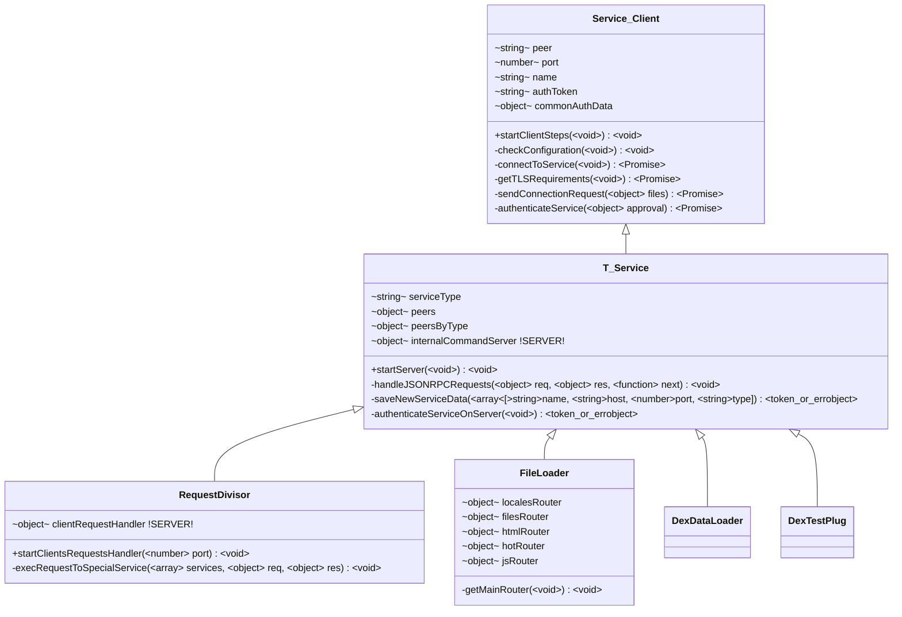

```mermaid
    classDiagram
        class Service_Client {
            ~string~ peer
            ~number~ port 
            ~string~ name
            ~string~ authToken
            ~object~ commonAuthData

            +startClientSteps(~void~) ~void~
            -checkConfiguration(~void~) ~void~
            -connectToService(~void~) ~Promise~
            -getTLSRequirements(~void~) ~Promise~
            -sendConnectionRequest(~object~ files) ~Promise~
            -authenticateService(~object~ approval) ~Promise~
        }

        class T_Service {
            ~string~ serviceType
            ~object~ peers
            ~object~ peersByType
            ~object~ internalCommandServer !SERVER!

            +startServer(~void~) ~void~
            -handleJSONRPCRequests(~object~ req, ~object~ res, ~function~ next) ~void~
            -saveNewServiceData(~array~[~string~name, ~string~host, ~number~port, ~string~type]) ~token_or_errobject~
            -authenticateServiceOnServer(~void~) ~token_or_errobject~
        }

        class RequestDivisor {
            ~object~ clientRequestHandler !SERVER!

            +startClientsRequestsHandler(~number~ port) ~void~
            -execRequestToSpecialService(~array~ services, ~object~ req, ~object~ res) ~void~
        }

        class FileLoader {
            ~object~ localesRouter
            ~object~ filesRouter
            ~object~ htmlRouter
            ~object~ hotRouter
            ~object~ jsRouter
            
            -getMainRouter(~void~) ~void~
        }

        class DexDataLoader {
        }

        class DexTestPlug {
        }

        Service_Client <|-- T_Service
        T_Service <|-- RequestDivisor
        T_Service <|-- FileLoader
        T_Service <|-- DexDataLoader
        T_Service <|-- DexTestPlug
```